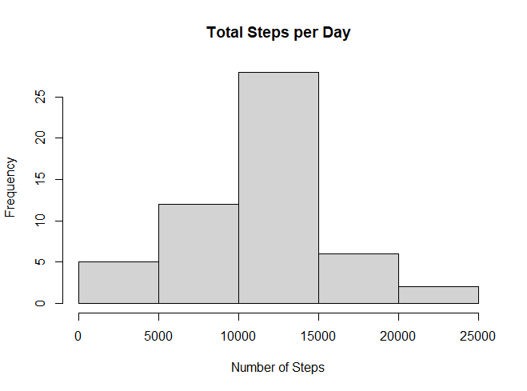
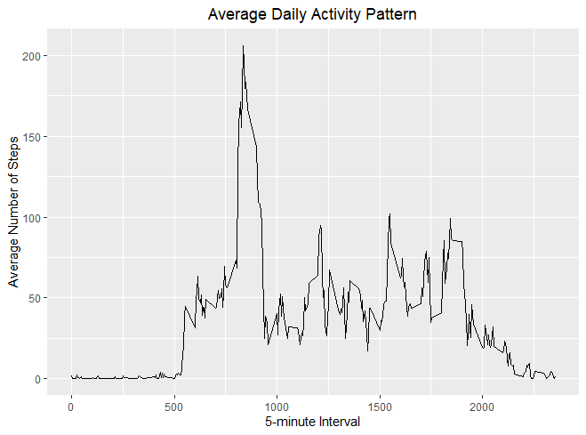
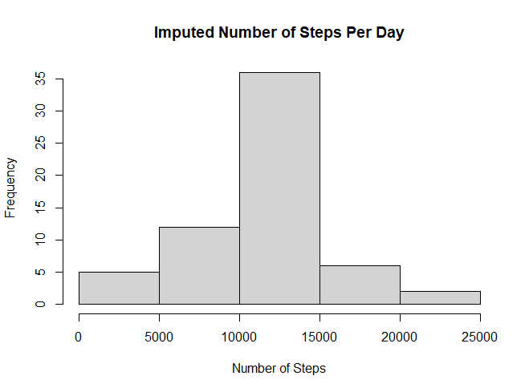

```{r setup, include=FALSE}
knitr::opts_chunk$set(echo = TRUE)
```
## Loading and preprocessing the data
```{r}
Data <- read.csv(file="activity.csv", header=TRUE)
```
## What is mean total number of steps taken per day?
## Make a histogram of the total number of steps taken each day
```{r TStepforday$steps, echo=FALSE}
TStepforday <- aggregate(steps ~ date, Data, FUN=sum)
hist(TStepforday$steps, main = "Total Steps per Day", xlab = "Number of Steps")
```
 


##  Mean and median number of steps taken each day 


```{r}
meanS <- mean(TStepforday$steps, na.rm = TRUE)
medD <- median(TStepforday$steps, na.rm = TRUE)
summary(meanS)
summary(medD)
```
## What is the average daily activity pattern?
## Make a time series plot
## Time series plot of the average number of steps taken (averaged across all days) versus the 5-minute intervals

```{r}
library(ggplot2)
meanSteps <- aggregate(steps ~ interval, Data, mean)
ggplot(data = meanSteps, aes(x = interval, y = steps)) + geom_line() + ggtitle("Average Daily Activity Pattern") + xlab("5-minute Interval") + ylab("Average Number of Steps") + theme(plot.title = element_text(hjust = 0.5))
```


## Report give the 5-minute interval that, on average, contains the maximum number of steps
```{r}
maxstepinterval <- meanSteps[which.max(meanSteps$steps),]
```
## Calculate and report the total number of missing values
```{r}
missingV <- is.na(Data$steps)
```
# Create a new dataset that is equal to the original dataset but with 
# the missing data filled in.
```{r}
miss_Data <- transform(Data, steps = ifelse(is.na(Data$steps),
                                            + meanSteps$steps[match(Data$interval,
                                                                    + meanSteps$interval)],
                                            + Data$steps))
```
## Report contain a histogram of the total number of steps taken each day after missing values were imputed

```{r}
iStepsbInt <- aggregate(steps ~ date, miss_Data,FUN=sum)
hist(iStepsbInt$steps, main = "Imputed Number of Steps Per Day", xlab = "Number of Steps")
impMeanSteps <- mean(iStepsbInt$steps, na.rm = TRUE)
impMedSteps <- median(iStepsbInt$steps, na.rm = TRUE)
diffMean = impMeanSteps - meanSteps
diffTotal = sum(iStepsbInt$steps) - sum(TStepforday$steps)
```


## Are there differences in activity patterns between weekdays and weekends?
## Create a new factor variable in the dataset with two levels – “weekday” and “weekend”
```{r}
DayType <- function(date) {
  day <- weekdays(date) 
  if (day %in% c('Monday', 'Tuesday', 'Wednesday', 'Thursday', 'Friday')) return ("weekeday")
  else if (day %in% c('Saturday', 'Sunday'))
    return ("weekend")
  else stop ("Format no valid") }
```
#For this part the weekdays() function may be of some help here.
```{r}
miss_Data$dateType <-  ifelse(as.POSIXlt(miss_Data$date)$wday %in% c(0,6), 'weekend', 'weekday')
```

## Make a panel plot comparing the average number of steps taken per 5-minute interval across weekdays and weekends


```{r}
AVG <- aggregate(steps ~ interval + dateType, data=miss_Data, mean)
ggplot(AVG, aes(interval, steps)) + geom_line() + facet_grid(dateType ~ .) + xlab("5-minute interval") + ylab("avarage number of steps")
```
